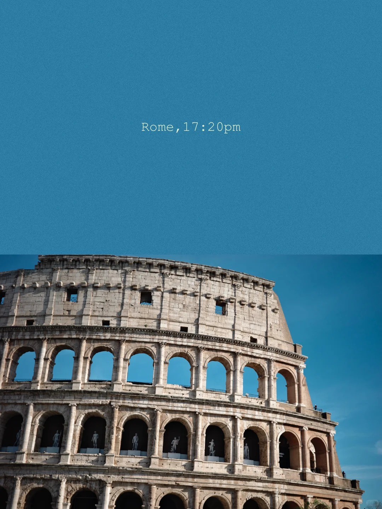
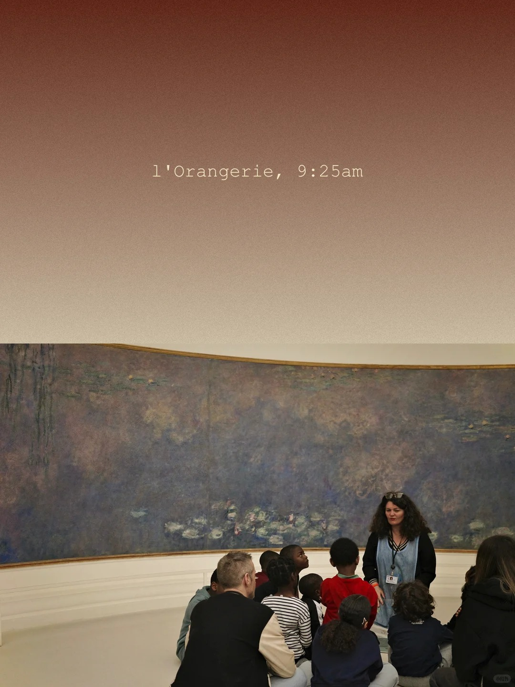
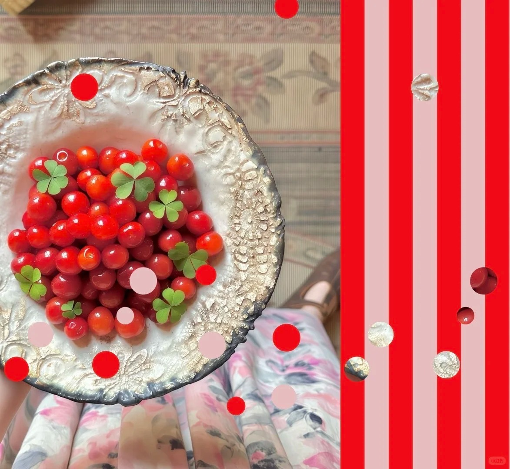
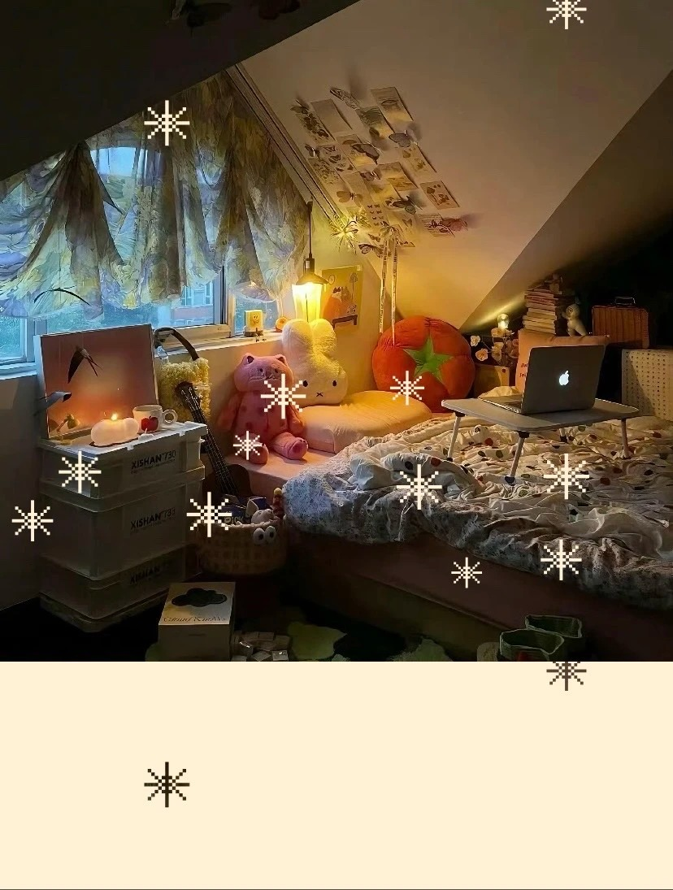

# ColorWalk Studio

Turn any photo into a playful visual composition.

ColorWalk Studio is a lightweight browser app for transforming everyday photos into poster-like images with color blocks, extracted palettes, dots, shapes, gradients, stripes, and text. It is designed for quick creative experiments, social visuals, moodboard material, and small image-led product demos.

<p align="center">
  
</p>

## What It Does

Upload a photo, choose a visual mode, adjust the composition, and export the result as an image.

ColorWalk Studio currently includes two creative tools:

- **ColorWalk**: combine a photo with a color block and text. The app can extract a color from the uploaded image and reuse it in the layout.
- **Dot Puzzle**: combine a photo with cutout dots, shapes, blocks, gradients, stripes, and text for a more playful collage effect.

## Features

- Upload and crop a photo in the browser
- Generate a color-block composition from an image
- Add custom text, colors, dots, shapes, gradients, and stripes
- Preview changes while editing
- Export finished visuals as PNG or JPG
- Browse ready-made looks and apply similar parameters to your own image
- Submit selected works to the community gallery
- Switch between English and Chinese UI

## Product Preview

### ColorWalk Mode

<p align="center">
  
</p>

### Dot Puzzle Mode

<p align="center">
  
</p>

### Inspiration Gallery

<p align="center">
  
</p>

## How To Use

1. Open the app.
2. Upload a photo.
3. Choose a creative mode.
4. Adjust the layout, color, text, dots, or shapes.
5. Download the final image as PNG or JPG.

## Local Setup

```powershell
python -m venv .venv
.\.venv\Scripts\Activate.ps1
pip install -r requirements.txt
python app.py
```

Then open `http://127.0.0.1:5000`.

If the virtual environment already exists, you can usually start from:

```powershell
.\.venv\Scripts\Activate.ps1
python app.py
```

## Environment Variables

Copy `.env.example` and set production-safe values:

```text
SECRET_KEY=replace-with-a-random-secret
ADMIN_PASSWORD=replace-with-a-strong-password
DATA_DIR=/app/data
SUBMISSION_SALT=replace-with-another-random-secret
MAX_COMMUNITY_SUBMISSION_MB=20
APP_BASE_URL=https://your-app.up.railway.app
```

For local development, the app also provides safe default values in `app.py`.

## Railway Deploy

This repo includes Railway deployment files:

- `railway.json`
- `Procfile`
- `requirements.txt`

Railway start command:

```text
gunicorn -w 2 -b 0.0.0.0:$PORT app:app
```

Health check:

```text
/healthz
```

After deploying, set the environment variables above in Railway.

## Tests

```powershell
python -m unittest discover -s tests
```

## Project Structure

```text
app.py              Flask routes and request parsing
utils/              Image generation and community store logic
templates/          Flask templates
static/css/         Shared styling
static/js/          Frontend state and UI interactions
static/gallery/     Demo gallery assets
tests/              Python regression tests
```

## License

Open source license is not set yet. Add a `LICENSE` file before promoting this as a reusable public project.
